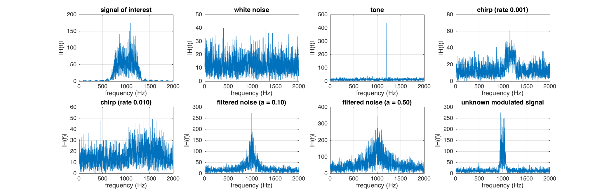

 
Inteference Signal Classification using Neural Network in Matlab  
Jun, 2019  
Jet Yu, ECE, Virginia Tech  
jianyuan@vt.edu    



# Slides
[performance Google slides](https://docs.google.com/presentation/d/1POVndvXnNvz2-mwR2zpuVd6MISutlEGou-EAwx-jbyw/edit?usp=sharing)

# Latex writings
[conference submission draft on overleaf](https://www.overleaf.com/read/ygzhcsgyqpts)

# News
(July 11) RNN with LSTM  `mainRNN.py` implemented, % accuracy at best.   
(July 11) DNN `mainDNN.py` implemented, 65% accuracy at best.  
(July 6) SVM imported, work pretty well.    
(July 3) alpha profile imported, but not perform well,    
(June 30) copyCat pass,    
(June 28) using downsample could reduce computation,    
(June 27) using FFT could reach accuracy 94%.  

# Roadmap
* get dataset from USRP
* deal with OFDM signal  


# Config
running on ARC VT is prefered. 
 * Matlab 
   * Machine Learning Toolbox  
   * GPU
* python
  * packages
      * `tensorflow`
      * `keras`
      * `matlibplot`
      * `hdf5storage`
      * `yagmail` - send result and codes to email
  * run `conda install conda-forge [package name]`
  * for yagmail, run `conda install -c atddatms yagmail`, if not work and error like `conflict with subproccess2`, try `pip install yagmail`  


# Generate interfer type  
* awgn  
* awgn+tone  
* awgn+chirp  
* awgn+filtN(filtered noise, low-passed white noise) 
* copyCat Noise, with unknown modulation and pulse shaping scheme.   

# How to run
* (Matlab) execute `main.m` file.
* (Python) run matlab file to generate data first, then `mainDNN.py` or `mainRNN.py`.

# How to run SVM in matlab
* download [libsvm](https://github.com/cjlin1/libsvm)  
* change directory to ./matlab
* execute `make.m` file, then new `.c` files are generated  
* load your `.mat` file, then 
  ```
  model = svmtrain(training_label_vector, training_instance_matrix, ['libsvm_options']);
  ```
* predict
  ```
  [predicted_label] = svmpredict(testing_label_vector,  ...
                                testing_instance_matrix, ...
                                model, ['libsvm_options']);
    ```

# Running Time
for default datasize of 16,000, data generation cost ~ 1min, and training takes ~8min.

# Bibliography
[Bibliography](./bib.md)

# Code Reference
[plot confusion matrix in Matlab](https://www.mathworks.com/matlabcentral/fileexchange/64185-plot-confusion-matrix)    
[cyclic spectral analysis](https://www.mathworks.com/matlabcentral/fileexchange/48909-cyclic-spectral-analysis)  
[libsvm - fast SVM](https://github.com/cjlin1/libsvm)


